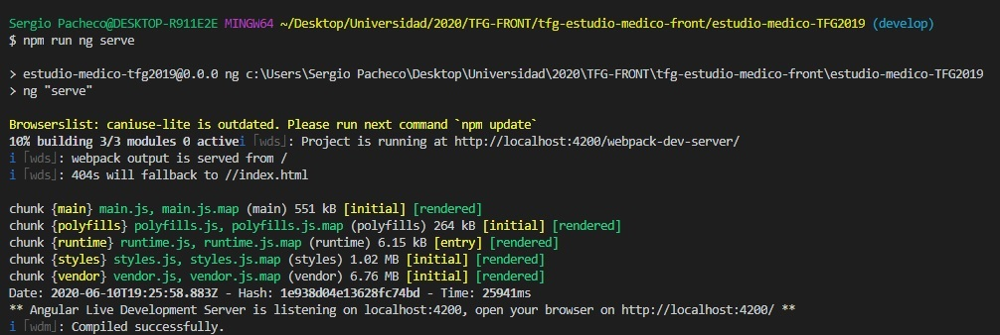

<p align="center">
  TRABAJO DE FIN DE GRADO 2019/2020. UCM. Facultad de Informática 
</p>

<p align="center">
  
</p>


## Esd2: Cuaderno de recogida de datos para un estudio médico

**-Autores:** Eduardo Gonzalo Montero & Sergio Pacheco Fernández

**-Proyecto Frontend:** Este repositorio contiene el proyecto en Angular el cual comprende los componentes y comportamientos web del proyecto.

**-Requisitos para ejecutar la aplicación:**
  - Tener instalada la interfaz de línea de comandos de Angular (Angular Cli).
  - Tener instalado Node.js, necesario para instalar y utilizar el gestor de paquetes npm.
  - IDE capaz de ejecutar proyectos Angular (En nuestro caso Visual Studio Code).
  
**-Pasos a seguir para inicializar el proyecto:**

  1. Abrir el proyecto en el IDE seleccionado y abrir una terminal de comandos para el mismo (normalmente haciendo click derecho sobre la carpeta raiz del proyecto y "abrir en terminal").

  2. Ejecutar los comandos:  
    - ``` npm install ``` : En el terminal para descargar todos los paquetes y dependencias necesarios.  
    - ``` ng serve ``` : En el terminal para lanzar el proyecto de Angular. Esta operación tardará unos segundos y se quedará corriendo una vez terminada. A veces el terminal puede no reconocer los comandos de Angular, en cuyo caso probar  ``` npm run ng serve ``` .
     
<p align="center">
  
</p>
    
  3. Como se observa en la figura anterior el proyecto se ha quedado escuchando por defecto en el puerto 4200 (Se puede modificar en caso de tener este puerto ocupado añadiendo al comando ``` ng serve ``` un ``` --port XXXX``` donde XXXX es el nuevo puerto). Para poder ver la web solo se debe abrir un navegador (Chrome recomendado) y navegar a la url "http://localhost:4200/".

